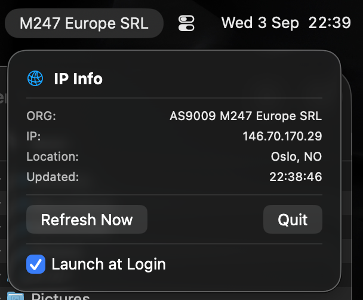

This is a macOS menu bar app to show and copy IP info

# Usage
- `Organization` is featured on the menu bar itself.
- Click to open view and click items to copy their values.

# Installation
- `just` is required: `brew install just`
- Build: `just build`
- Compile: `just bundle`
- Zip release: `just zip`
- Install into your Applications: `just install`

