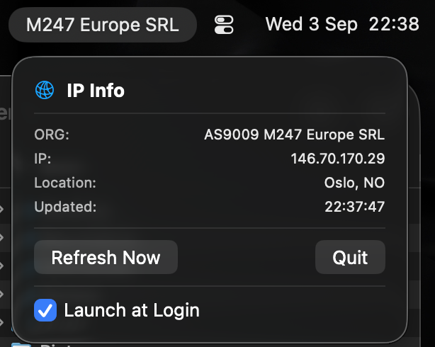

# ISPOrgMenuBarApp

Simple macOS menu bar app to show the ISP organization name. Useful for quickly verifying if you are on a VPN connection or not.

# Installation
- `just` is required: `brew install just`
- Build: `just build`
- Compile: `just bundle`
- Zip release: `just zip`
- Install into your Applications: `just install`

